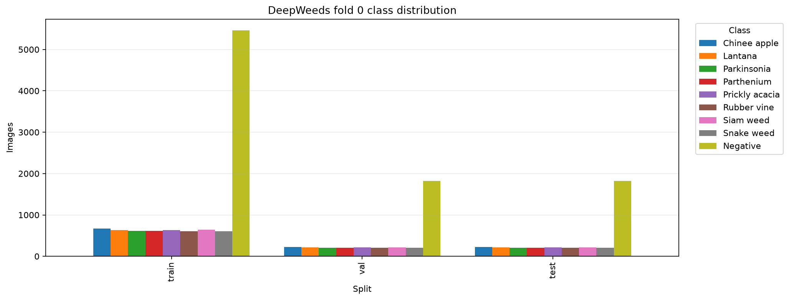
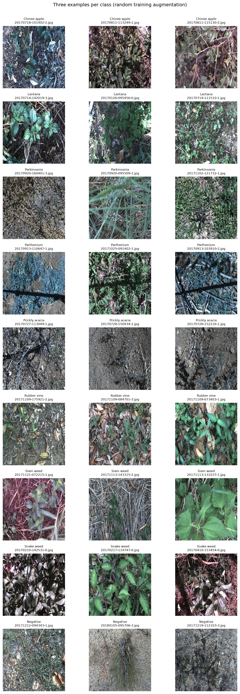
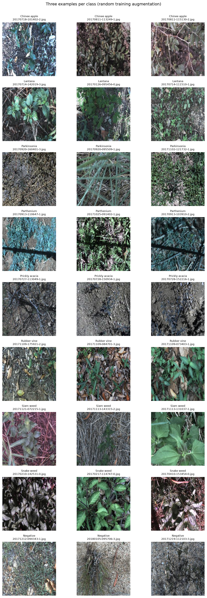

# Báo cáo lab: Backbone, công thức huấn luyện và suy luận trên DeepWeeds

> **Trạng thái báo cáo: chưa phải báo cáo chung kết.** Đây là phần tổng kết trung thực từ các artifact hiện có đến ngày 04-10-2026. Chưa có kết quả test, chưa đủ 3 seed cho cấu hình cuối, và baseline cuối bị dừng giữa chừng. Mọi điểm số dưới đây là **validation**, trừ khi ghi khác. Không suy diễn kết quả test từ validation.

## 1. Tóm tắt

- Dùng DeepWeeds fold 0, 9 lớp; kiểm tra split lưu trong summary xác nhận 17.509 ảnh, không giao nhau và không thiếu ảnh.
- Đã huấn luyện 5 backbone với cùng công thức nền và chạy 13 cấu hình/ablation trên ConvNeXt-Tiny; tất cả các run này có seed 0.
- ConvNeXt-Tiny đạt macro-F1 validation cao nhất trong nhóm backbone: **0,9497**. Recipe T12 (CutMix + label smoothing 0,1 + EMA) cao nhất trong nhóm ablation: **0,9648**.
- F01 seed 0 đã huấn luyện xong 12 epoch và đạt macro-F1 validation **0,9648**, top-1 **0,9732**; chưa chạy test.
- Độ trễ one-view đo sơ bộ trên RTX 3050 Laptop GPU; B03 có p95 **8,337 ms**, batch 1, fp32, chỉ tính forward.
- Chưa có so sánh TTA/ensemble/temperature scaling, chưa có test predictions, eval.py score/grade hoặc results.xlsx.
- Do chỉ có một seed, chênh lệch hiện tại là quan sát validation, chưa thể kết luận vượt nhiễu giữa các seed.

## 2. Dữ liệu và thiết lập

### Dataset và kiểm tra split

DeepWeeds gồm ảnh RGB 256×256 thuộc 9 lớp. Thí nghiệm sử dụng bộ CSV fold 0 có sẵn, không chia lại và không gộp validation vào train.

| Lớp | Train | Val | Test |
|---|---:|---:|---:|
| Chinee apple | 675 | 225 | 226 |
| Lantana | 637 | 213 | 213 |
| Parkinsonia | 618 | 206 | 207 |
| Parthenium | 613 | 204 | 205 |
| Prickly acacia | 637 | 212 | 213 |
| Rubber vine | 605 | 202 | 202 |
| Siam weed | 644 | 215 | 215 |
| Snake weed | 609 | 203 | 204 |
| Negative(s) | 5.463 | 1.821 | 1.822 |
| **Tổng** | **10.501** | **3.501** | **3.507** |

Tỉ lệ tương ứng là 59,97% / 20,00% / 20,03%. Kiểm tra được lưu trong runs_final/F01/seed0/summary.json: giao train-val, train-test và val-test đều bằng 0; hợp có 17.509 ảnh; missing_images=0. Trong train, lớp lớn nhất có 5.463 ảnh, lớp nhỏ nhất 605 ảnh, tỉ số xấp xỉ **9,03:1**. Sự mất cân bằng này khiến accuracy đơn lẻ không đủ để đánh giá; macro-F1 và recall theo lớp được báo cáo kèm.

Các hình EDA đã lưu:

### Thiết lập huấn luyện

- Phần cứng ghi trong artifact: NVIDIA GeForce RTX 3050 Laptop GPU; CUDA được chọn tự động.
- Môi trường trong summary: Python 3.13.5, PyTorch 2.12.0+cu130, torchvision 0.27.0+cu130, timm 1.0.15, NumPy 2.5.2, pandas 2.3.3, scikit-learn 1.9.1, matplotlib 3.11.2.
- Đầu vào 224×224; 12 epoch; batch size 4; AMP bật; 2 DataLoader workers.
- Backbone khởi tạo bằng trọng số tiền huấn luyện theo tag ghi trong từng config; LR backbone 1e-4, LR head 1e-3, weight decay 0,05, warmup 1 epoch. Baseline dùng CE; checkpoint chọn theo macro-F1 validation cao nhất.
- Công thức cuối đã huấn luyện (F01): ConvNeXt-Tiny in12k_ft_in1k, fine-tune toàn mạng, CutMix alpha 1, label smoothing 0,1, EMA decay 0,999. Cấu hình đầy đủ: runs_final/F01/seed0/config.json.
- Pipeline unit tests có 41 test pass theo lần chạy đã ghi nhận trước đó; không chạy lại test trong lượt hoàn thiện báo cáo này.

## 3. So sánh backbone

Cùng split, seed 0, 12 epoch và công thức CE nền. GMAC được ghi theo fvcore FLOPs/2. Thời gian/epoch là số trong runs/selection.json; độ trễ là phép đo one-view batch 1.

| ID | Backbone (tag trọng số) | Params (M) | GMAC | s/epoch | Macro-F1 val | Top-1 val | p95 (ms) |
|---|---|---:|---:|---:|---:|---:|---:|
| B01 | ResNet-50 (a1_in1k) | 23,526 | 2,055 | 118,14 | 0,8568 | 0,8906 | 7,236 |
| B02 | ResNeXt-50 32×4d (a1h_in1k) | 22,998 | 2,129 | 123,47 | 0,8465 | 0,8860 | 6,844 |
| B03 | ConvNeXt-Tiny (in12k_ft_in1k) | 27,827 | 2,235 | 132,55 | **0,9497** | **0,9617** | 8,337 |
| B04 | DeiT-Small patch16 (fb_in1k) | 21,669 | 2,125 | 111,25 | 0,9388 | 0,9546 | **6,200** |
| B05 | MobileNetV3-Large (ra_in1k) | 4,214 | 0,112 | **88,58** | 0,9002 | 0,9206 | 9,347 |

ConvNeXt-Tiny được chọn cho ablation vì macro-F1 validation cao nhất trong nhóm này. MobileNetV3 nhỏ hơn đáng kể và có thời gian huấn luyện mỗi epoch thấp nhất, nhưng macro-F1 validation thấp hơn 0,0495 so với B03. DeiT có p95 thấp nhất trong phép đo one-view này, còn B03 không phải backbone có độ trễ thấp nhất. Các số này chỉ phản ánh một seed và phép đo trên một GPU.

Biểu đồ training theo run nằm trong [curves/](curves/), ví dụ [B03](curves/B03_seed0.png). Checkpoint, lịch sử epoch và config nằm dưới runs/<exp_id>/seed0/.

## 4. Công thức huấn luyện và ablation

T00 là baseline ConvNeXt-Tiny fine-tune, augmentation cơ bản và CE. Mỗi T01–T11 thay một thành phần; T12 là công thức kết hợp có chủ đích. Chỉ số Δ là macro-F1 validation so với T00 cùng seed 0.

| ID | Thay đổi so với T00 | Best epoch | Macro-F1 val | Top-1 val | Δ macro-F1 |
|---|---|---:|---:|---:|---:|
| T00 | Baseline | 12 | 0,9497 | 0,9617 | 0,0000 |
| T01 | Khởi tạo ngẫu nhiên | 9 | 0,5590 | 0,6775 | −0,3907 |
| T02 | Đóng băng backbone | 12 | 0,8648 | 0,8929 | −0,0849 |
| T03 | Color augmentation | 11 | 0,9490 | 0,9606 | −0,0007 |
| T04 | RandAugment | 12 | 0,9532 | 0,9632 | +0,0036 |
| T05 | Label smoothing 0,1 | 12 | 0,9508 | 0,9617 | +0,0011 |
| T06 | Focal loss, gamma 2 | 11 | 0,9549 | 0,9643 | +0,0053 |
| T07 | CE trọng số nghịch tần suất, beta 0 | 12 | 0,9496 | 0,9614 | −0,0001 |
| T08 | Balanced sampler | 11 | 0,9458 | 0,9566 | −0,0039 |
| T09 | CutMix, alpha 1 | 11 | 0,9604 | 0,9700 | +0,0107 |
| T10 | Mixup, alpha 0,2 | 12 | 0,9510 | 0,9614 | +0,0013 |
| T11 | EMA, decay 0,999 | 12 | 0,9502 | 0,9623 | +0,0005 |
| T12 | CutMix + LS 0,1 + EMA 0,999 | 12 | **0,9648** | **0,9732** | **+0,0151** |

Trong các thay đổi đơn lẻ, CutMix có Δ validation lớn nhất (+0,0107). T12 cao hơn T00 0,0151; vì T12 kết hợp ba yếu tố nên không thể tách phần cải thiện thành tác động riêng của từng yếu tố. Khởi tạo ngẫu nhiên và đóng băng toàn bộ backbone thấp hơn rõ rệt trong cấu hình 12 epoch này, phù hợp với vai trò của fine-tuning trọng số pretrained trên tập dữ liệu nhỏ. Những chênh lệch nhỏ như T03, T05, T07, T10, T11 chưa thể xem là cải thiện có ý nghĩa: mỗi cấu hình chỉ chạy một seed, không có std.

## 5. Suy luận và độ trễ

Artifact inference_results.csv chỉ chứa phép đo one-view trên checkpoint của năm backbone; không có TTA, multi-crop, ensemble hay temperature scaling. Đo trên RTX 3050 Laptop GPU, fp32, batch 1, 10 lượt warm-up, 50 lượt đo, forward-only và không tính preprocessing.

| ID | p50 (ms) | p95 (ms) | p99 (ms) | Ảnh/s |
|---|---:|---:|---:|---:|
| B01 | 4,953 | 7,236 | 8,815 | 201,9 |
| B02 | 5,907 | 6,844 | 8,814 | 169,3 |
| B03 | 5,500 | 8,337 | 8,591 | 181,8 |
| B04 | 5,339 | 6,200 | 6,474 | 187,3 |
| B05 | 5,611 | 9,347 | 10,370 | 178,2 |

Trong phép đo sơ bộ, cả năm backbone đều có p95 dưới 100 ms/ảnh ở batch 1. B04 có p95 thấp nhất; B03 có macro-F1 validation cao nhất. Đây chưa phải kết quả deployment của F01 cuối: độ trễ chưa được đo lại trên checkpoint F01, và chưa có macro-F1 test để ghép với tiêu chí này. ECE validation one-view của B03 là 0,0329. F01 seed 0 có ECE validation 0,0781; không có phép đo trước/sau temperature scaling để kết luận về calibration.

## 6. Cấu hình cuối và phân tích lỗi

F01 seed 0 dùng cùng recipe T12 trên ConvNeXt-Tiny và hoàn thành 12 epoch. Kết quả validation lưu trong runs_final/F01/seed0/summary.json:

| Macro-F1 | Top-1 | Balanced accuracy | ECE | Best epoch |
|---:|---:|---:|---:|---:|
| 0,9648 | 0,9732 | 0,9612 | 0,0781 | 12 |

F1 và recall validation theo lớp của F01 seed 0:

| Lớp | Recall val | F1 val |
|---|---:|---:|
| Chinee apple | 0,8622 | 0,9129 |
| Lantana | 0,9906 | 0,9591 |
| Parkinsonia | 0,9854 | 0,9878 |
| Parthenium | 0,9902 | 0,9951 |
| Prickly acacia | 0,9717 | 0,9717 |
| Rubber vine | 0,9703 | 0,9849 |
| Siam weed | 0,9814 | 0,9746 |
| Snake weed | 0,9113 | 0,9136 |
| Negative(s) | 0,9879 | 0,9831 |

Trên validation, Chinee apple và Snake weed là hai lớp có recall/F1 thấp nhất; đây cũng là cặp được tài liệu lab lưu ý. Chưa có ma trận nhầm lẫn hoặc rà soát ảnh sai của **test**, nên chưa thể xác nhận hai lớp này nhầm lẫn trực tiếp với nhau trong lần chạy này.

### Kết quả test và baseline cuối

**Chưa có kết quả test.** test_saved=false trong summary F01 và config đặt save_test_predictions=false; thư mục predictions/ hiện lưu dự đoán validation. Do vậy chưa thể báo macro-F1, top-1, ECE hoặc recall theo lớp trên test, chưa thể tính mean ± std hay điểm eval.py grade.

Phân biệt hai run có cùng ID T00: ablation runs/T00/seed0 đã hoàn thành 12 epoch và có macro-F1 validation 0,9497; baseline tái huấn luyện cuối runs_final/T00/seed0 chỉ có 5 epoch trong history.csv và không có summary hoàn tất. Đây không phải baseline chung kết hoàn thành.

## 7. Kết luận, hạn chế và bước hoàn thiện

Trong số liệu validation hiện có, ConvNeXt-Tiny là backbone mạnh nhất; T12 là recipe mạnh nhất, với macro-F1 0,9648 so với 0,9497 của T00. CutMix là thay đổi đơn lẻ có mức tăng lớn nhất trong ablation (Δ +0,0107). Những kết luận này chỉ dùng để lựa chọn thí nghiệm tiếp theo, chưa chứng minh mức tăng ổn định vì chỉ có seed 0. Đo one-view sơ bộ cho thấy B04/B03 có p95 lần lượt 6,200/8,337 ms trên GPU hiện có; chưa đủ dữ liệu để chọn model triển khai cuối cùng theo chất lượng test.

Hạn chế chính: một fold ngẫu nhiên (không chia theo địa điểm), một seed cho mỗi run, chưa chạy so sánh suy luận, chưa đánh giá test và chưa kiểm tra lỗi trên ảnh test. Chia ngẫu nhiên theo ảnh có thể làm điểm lạc quan khi triển khai sang địa điểm hoặc mùa khác. Ngân sách GPU thực tế khiến phần chung kết còn dang dở.

Để hoàn tất bộ nộp theo rubric, cần tiếp tục theo thứ tự trong [RUNBOOK.md](RUNBOOK.md):

1. Hoàn tất F01 và T00 baseline với ít nhất 3 seed tổng cộng, giữ nguyên fold 0 và recipe đã chọn.
2. Chốt inference trên validation; nếu dùng temperature scaling, fit T trên validation. Không chọn cấu hình bằng test.
3. Lưu validation predictions cuối cho từng seed; sau khi chốt cấu hình, chạy test đúng một lần cho mỗi seed cho cả F01 và T00, lưu CSV theo định dạng lab.
4. Chạy eval.py score và eval.py grade, sau đó tạo results.xlsx; thay các phần “chưa có” trong báo cáo bằng số đã tính từ prediction CSV.
5. Thêm ma trận nhầm lẫn và rà soát ảnh lỗi từ kết quả đã lưu; ghi link notebook vào README nộp bài nếu có notebook công khai.

Các artifact đang có: runs/ (backbone/ablation), runs_final/F01/seed0/ (final seed 0), predictions/*_val.csv, curves/, eda/, runs/selection.json và inference_results.csv. Checkpoint và dataset nằm ngoài nội dung cần commit; .gitignore đã loại chúng khỏi git.

## Phụ lục: định nghĩa số liệu

Macro-F1 là trung bình F1 của 9 lớp; top-1 là accuracy không trọng số; balanced accuracy là trung bình recall; ECE dùng 15 bin confidence như mô tả trong README.md. Các số trong bảng là kết quả validation đã lưu, làm tròn 4 chữ số (độ trễ làm tròn 3 chữ số). Thời gian/epoch, số tham số, GMAC và latency được trích từ runs/selection.json, các summary.json và inference_results.csv; các prediction test chưa được tạo.

